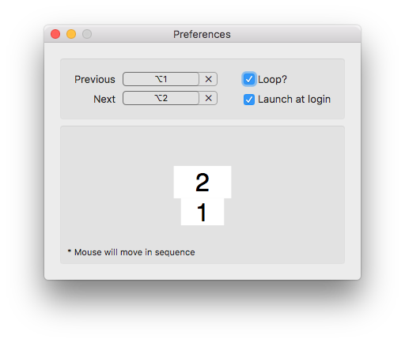

# Movse

## 这啥
一个超级简单的多屏幕鼠标移动工具 for Mac。  
灵（chao）感（xi）来源于 [Hammerspoon] 和 [CatchMouse]。

## 安装
下载源码编译，或者[点此下载最新版本](https://github.com/tgmeng/Movse/releases/latest "最新版本")。  
将 Movse.app 拖到「应用程序」里即可。

## 使用

- **Previous & Next**：设置鼠标「前进/后退」快捷键；
- **Loop?**：循环切换（是否首尾屏幕衔接）；
- **Launch at login**：开机启动；
- **屏幕布局**：当前屏幕布局，每个区块代表一个屏幕和其切换顺序；点击白块，鼠标可切换到相应屏幕。

## License
This project is licensed under the MIT License - see the [LICENSE](LICENSE) file for details

[Hammerspoon]: https://github.com/Hammerspoon/hammerspoon "Hammerspoon"
[CatchMouse]: https://github.com/round/CatchMouse "CatchMouse"
